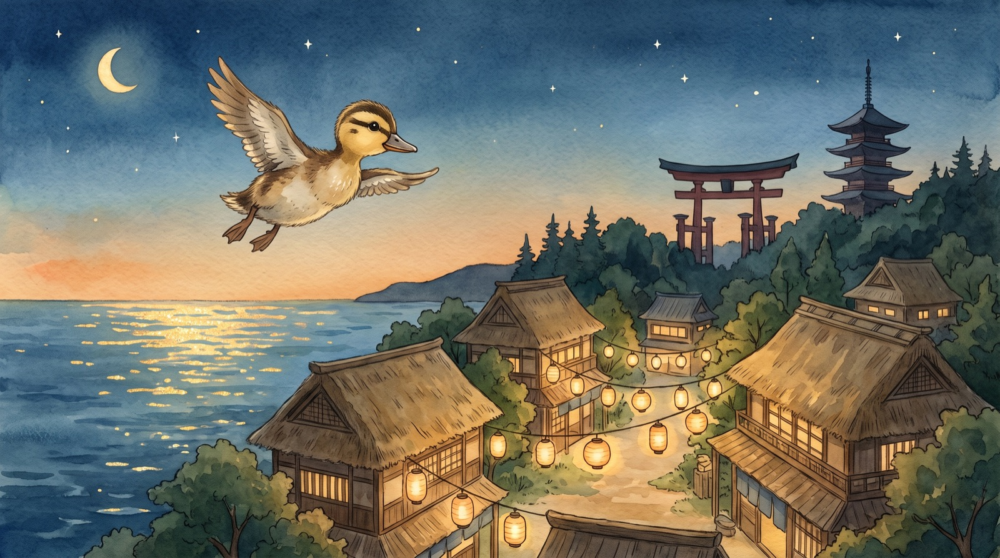
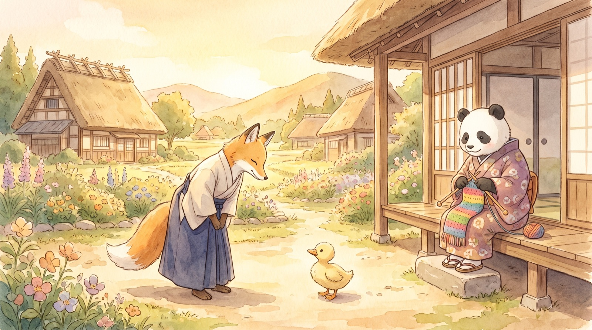
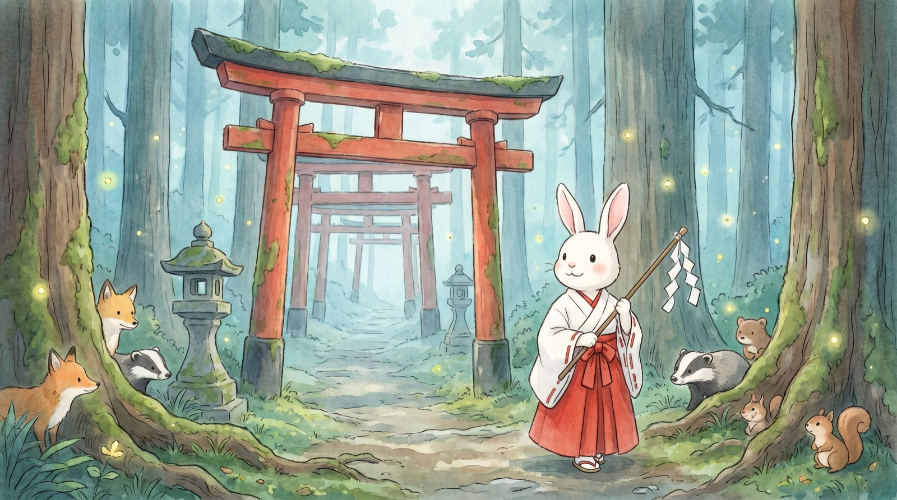
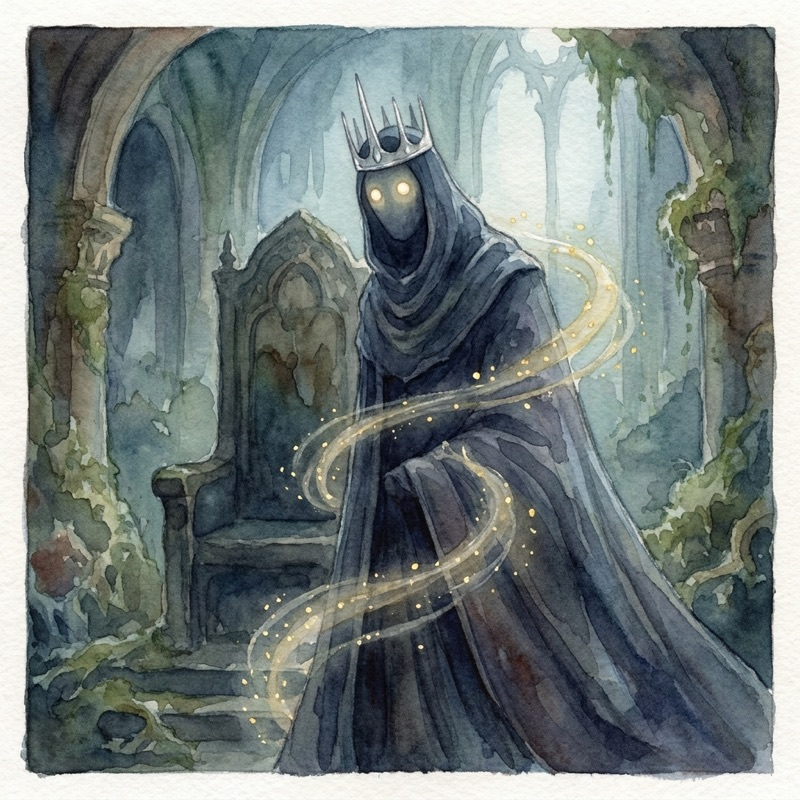

# 🦆 カモのことだまクエスト — Kamo's Kotodama Quest

An RPG that takes you from **zero Japanese to JLPT N2**. You are カモ, a little
duck washed ashore on an island where words are living spirits (ことだま) — and
a creeping Silence has stolen them all, including your voice.

| | | |
|---|---|---|
|  |  |  |

## Play

Open `index.html` in any modern browser — desktop or phone. That's it: no
install, no build, no account. All pronunciation is **recorded native audio**
(683 clips shipped with the game); it also installs as an offline PWA when
served over HTTPS.

## How it works

- **No romaji, ever.** Kana are taught by native audio (🔊) plus English sound
  descriptions and mnemonics; words are taught with emoji and pictures; kanji
  always carry furigana (toggle in settings).
- **Progressive immersion.** Once a word spirit joins you, its English shadow
  fades: get a word right 3 times and English disappears for it forever.
  Chapters 1–4 speak English around the Japanese; chapter 5 flips to Japanese
  with English subtitles; from chapter 6 (post-N5 exam) the entire game — UI,
  quests, dialogue, grammar explanations — is 100% Japanese.
- **Quest-driven curriculum**, 8 chapters / 42 quests:
  1. **おとのない はま** — all hiragana (incl. dakuten, combos, っ)
  2. **カタカナ港** — all katakana + first loanwords
  3. **ひだまり村** — greetings, は/です/か, numbers, family, first kanji
  4. **うごく ことだま** — verbs, adjectives, particles を・に・で・へ・が
  5. **すずのね町** — time, past tense, あります/います … then the **N5 exam boss**
  6. **都** — て形, ない形, potential, giving/receiving (all Japanese now)
  7. **かみやま** — 〜と思う, conditionals, 受身/使役
  8. **しじまの城** — 命令形, ので/のに/はず, final N4 boss gauntlet
- **Content:** ~450 vocabulary words, ~230 kanji, 46 grammar points, full kana.
- **Battles** are quizzes with teeth: right answers strike the enemy, wrong
  ones hurt you. Kanji readings are typed on an on-screen kana keyboard.
- **SRS-lite mastery** (0–5 per item) + ⛩️ Review Training in the pause menu
  for your weakest words.
- **Pause menu (Esc):** quest journal, kana charts, kanji dex, grammar book,
  review, settings (furigana/voice), save/load.
- **Saves:** autosave after every quest + 3 manual slots (localStorage) +
  export/import as text for backup or moving devices.
- **Art & sound:** 35 storybook-watercolor illustrations (title, per-chapter
  cutscenes, NPC dialogue portraits, boss battle art) in `assets/img/`, plus a
  procedural WebAudio chiptune engine — Japanese pentatonic area themes, a
  battle theme, and a victory sting, all generated in code (no audio files).
  The game still runs fine if `assets/` is deleted (emoji/gradient fallback).

## Controls

Move: arrow keys / WASD · Talk: walk into someone · Advance dialogue:
click / Enter / Space · Answer quiz: click or keys 1–4 · Menu: Esc

## Dev

`node validate.js` — integrity check for the curriculum data (every quest item
exists, every word is taught, no romaji leaks, maps are consistent).
